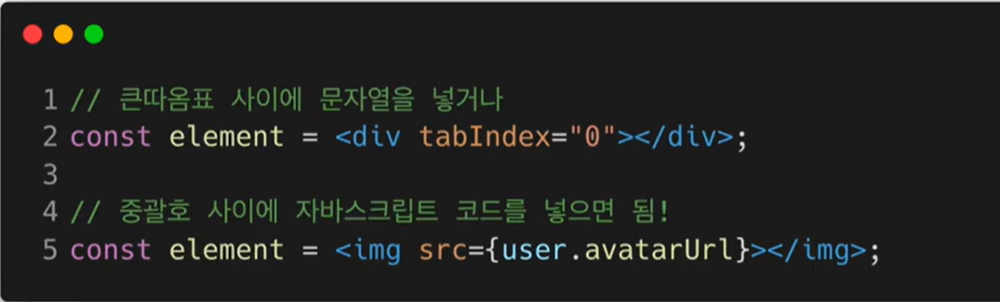
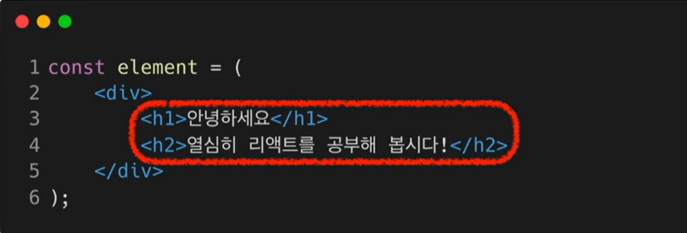

## JSX

- 정의

-- A syntax extension to JavaScript
-- 자바스크립트 확장 문법
-- JavaScript + XML / HTML

```
JSX 코드
--> const element = <h1>Hello,world!</h1>
```

- 역할(왜 사용해야해?)

  -- XML와 HTML코드를 자바스크립트로 변환한다.<br>

  --JSX코드로 하게 되면 최종적으로 자바스크립트로 나온다.

  --
  
  --![] (https://velog.velcdn.com/images/heejunggg/post/f2067127-b078-404e-b16e-95cd4016f5cf/image.png)
  --
  

-- 리액트는 createElement로 변환한다.<br>
-- 리액트에서 JSX를 쓰는것은 필수는 아님.
하지만 JSX를 사용하면 장점들이 많기 떄문에 편리함.

- 장점
  -- 
  -- 가독성 향상
  -- 버그를 발견하기 쉬움
  -- Injection Attacks(해킹방법)방어

- ## 사용법

1. JavaSCript 코드 + XML / HTML
   

-- 2. ..XML/HTML
{JavaScript코드}
..XML/HTML
중괄호를 쓴다.
위의코드 {name}에서 처럼.

-- 3. 태그의 속성(attribute)에 값을 넣는 방법


-- 4. children을 정의하는 방법

