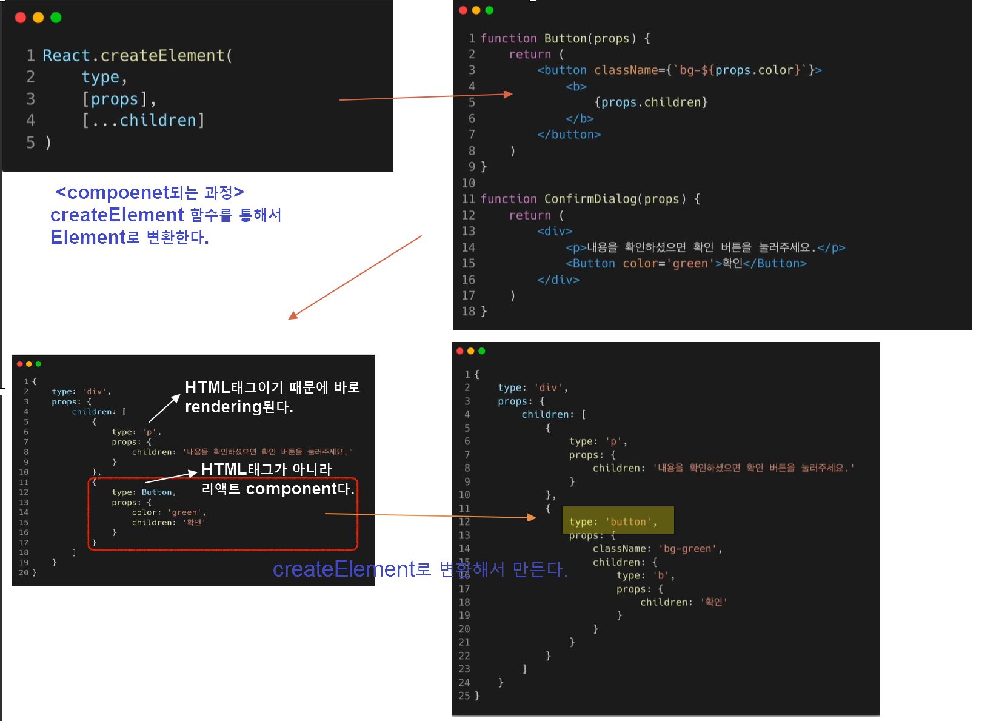
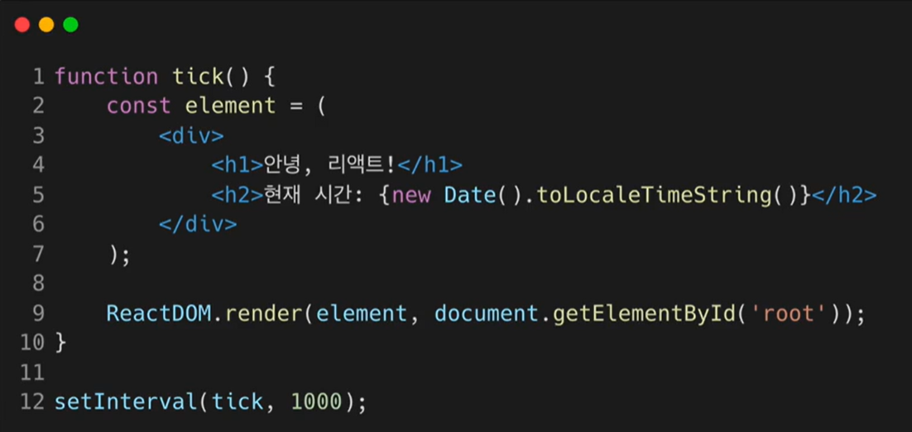

> ### Rendering Element

## `Elements의 정의와 생김새`

- 어떤 물체를 구성하는 성분, 요소
- 리액트 앱을 구성하는 가장 작은 블록들
- 리액트 Elements는 자바스크립트 객체 형태로 존재
  

--> 위의 코드에서  

## component가 랜더링되는 과정

- 모든 컴포넌트가 creatElement함수를 통해서 Element로 변환된다.

## 1. 불변성(변하지 않는 성질)

- 한번생성된 Element는 변하지 않는다.
- Elements 생성 후에는 Children이나 attributes를 바꿀 수 없다.
  - 그렇다면 화면갱신이 안되나?
    
    `--> 한번 만들어진 붕어빵은 변경.수정이안된다.
그럼,변경된 Element들을 보여주려면?
   새로운 Element를 만들어서 기존의 Element를 바꿔치기하면 된다.
   virtulDOM은 새로운 것만 바꿔주니까.`

## 2. Elements 렌더링하기

`-- virtulDOM 에서 브라우저 DOM으로 이동된다는 얘기`

//

`-- tick함수가 호출될 떄마다 기존 Element를 변경하는 것이 아니라 새로운 Element를 생성해서 바꿔치기 하는 것이다.`

`-- 갱신되는 부분만 반짝인다.`

### Element를 업데이트 하기 위해서는 새롭게 만들어야 함을 잊지 말자!
