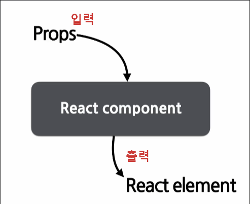
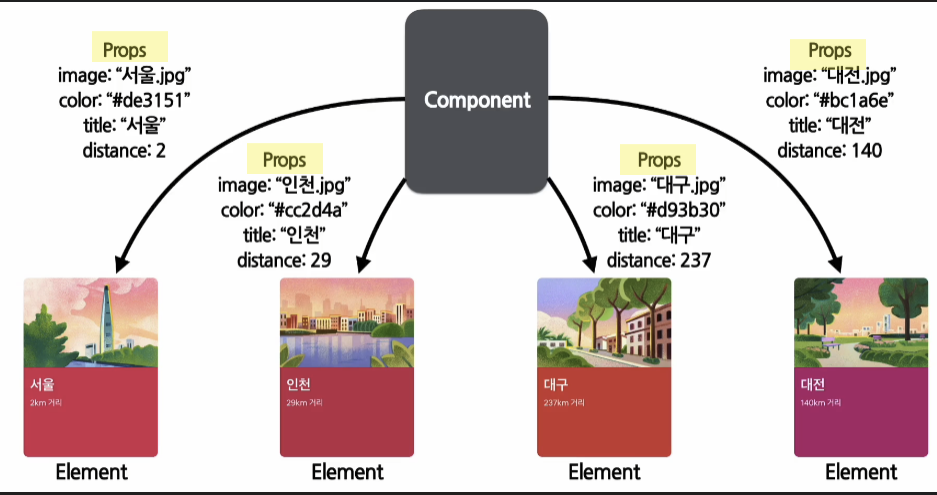
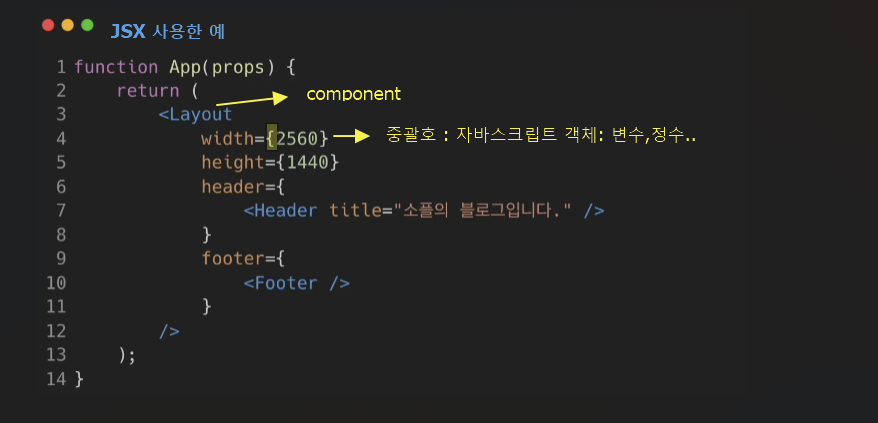
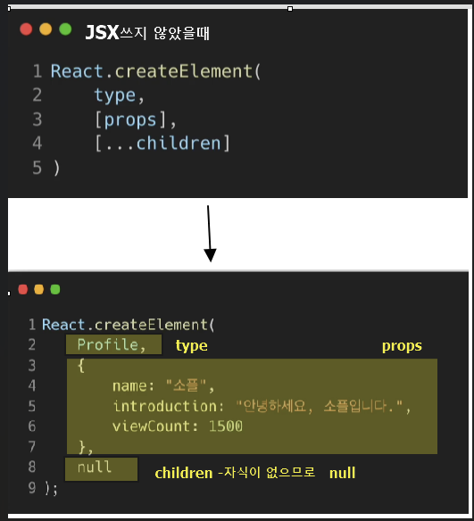
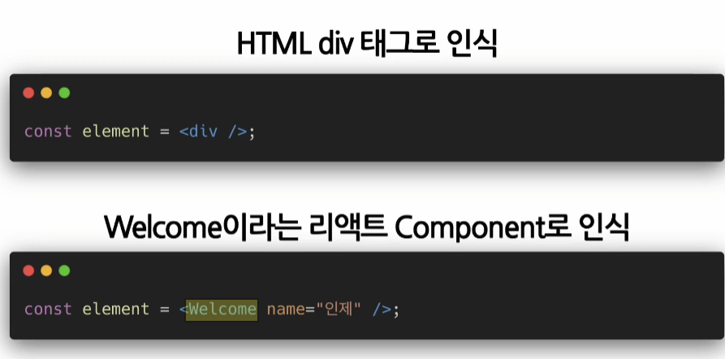
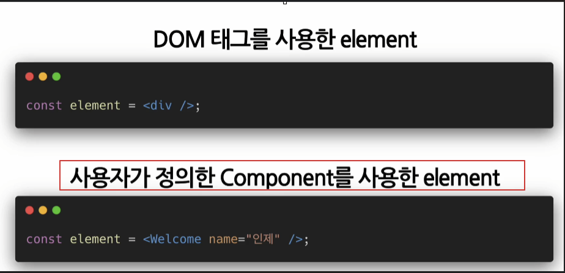
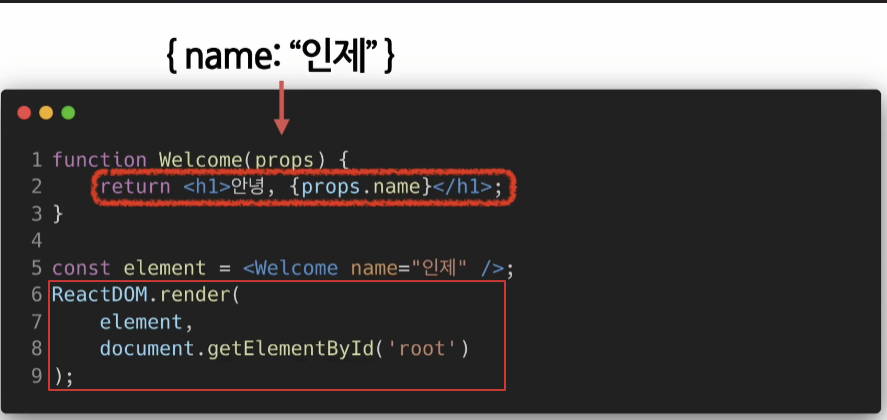

## 1. Components와 Prop의 정의

` Components`

- 어떤한 속성들을 입력으로 받아서 그에 맞는 엘리먼트를 받아서 반환해준다.
- 리엑트 엘리먼트 : 자바스크립트 객체 형태로 존재하며 화면에 보이게 기술한다.
- 리엑트 컴포넌트 : 만들고자 하는 대로, 입력하는 props, 즉 속성을 넣으면 화면에 나타날 Element를 만들어 주는 것이다.

`Props`

- prop이 여러개
- Proerty- 속성
- 무엇의 속성 ? - Component의속성 - 붕어빵을 생각 - 붕어빵의 재료
- 컴포넌트에 전달할 다양한 정보를 담고 있는 자바스크립트 객체

## 2. Props의 특징

- Read-Only -값을 변경할 수없다.
- Element의 값을 바꾸려면?
- 새로운 값을 컴포넌트에 전달하여 새로 Element를 생성
- 모든 리액트 컴포넌트는 그들의 Props에 관해서는 Pure함수 같은 역할을 해야한다.
- 모든 리액트 컴포넌트는 Props를 직접 바꿀 수 없고, 같은 Props에 대해서는 항상 같은 결과를 보여줄것!
  - 같은 피라미터 값, 같은 결과 -Pure한 자바스크립트 함수 걔념

## 2-1. Props 사용법

- 
- 

## 3. Component 만들기 및 렌더링

- Component 이름은 항상 대문자로 시작해야함

`Component 렌더링`

- 1. 컴포넌트는 대문자여야 한다.
     
     ////
- == 2.
- 
  

  -설명 :  
  Welcome이라는 컴포넌트를 선언하고 name:인제라는 값을 가진 element를 피라미터로 해서 ReactDOM.render함수를 호출한다.

- Welcome이라는 컴포넌트에 name:인제라는 props를 넣어서 호출하고,그결과로 react element가 생성된다.
- 최종적으로, 리엑트 돔에 업데이트가 되고 브라우저에서 볼수 있다.
