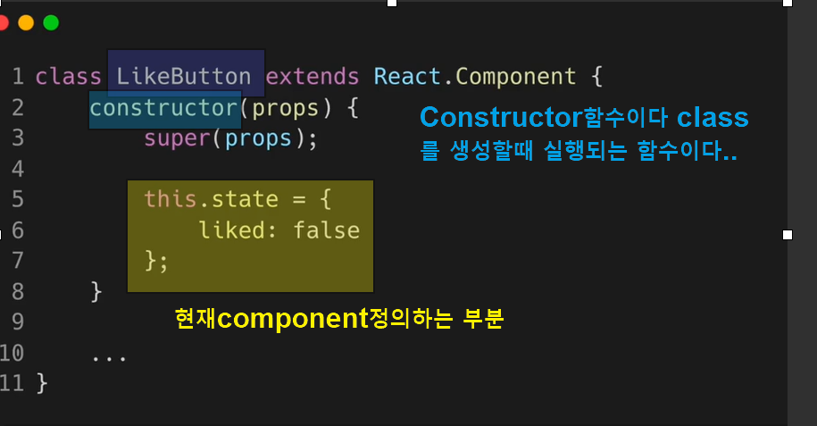
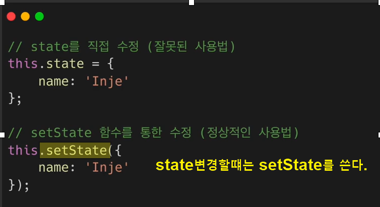
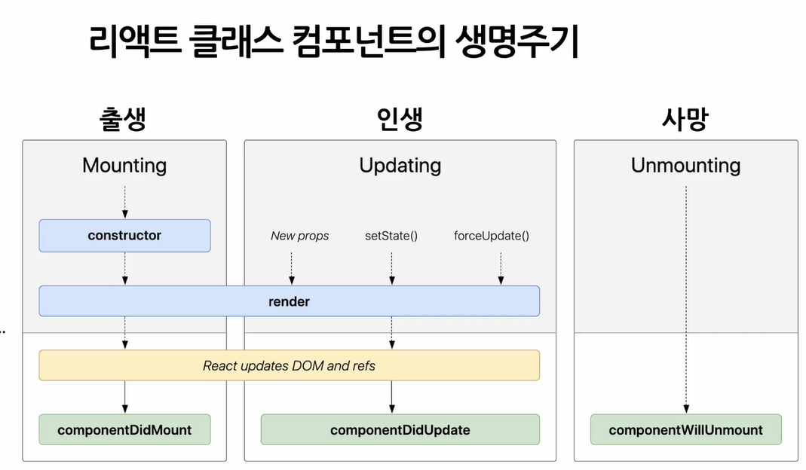

## 1. State and Lifecycle 정의

\ state

- state는 리액트의 핵심임으로 반복학습!!!
- 리액트의 변경가능한 데이터 -렌더링이나 데이터 흐름에 사용되는 값만 state에 포함시켜야 함
- stae가 변경되면 component가 재랜더링 되기 때문에 관련없는 값을 포함하면 성능저하
- state는 javascript의 객체이다.
  
- state는 직접 수정할 수 없다.
- 

\ Lifecycle (생명주기)

- 
- Component가 계속 존재하는 것이 아니라, 시간으 흐름에 따라 생성되고 업데이트 되다가 사라진다.
- (실습) Sate 사용하기----해볼것!!
