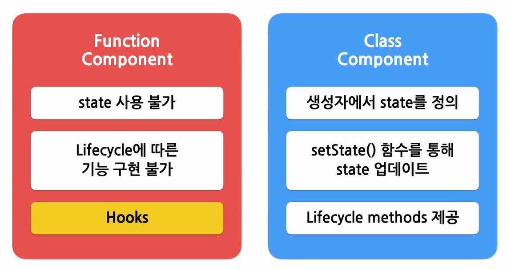
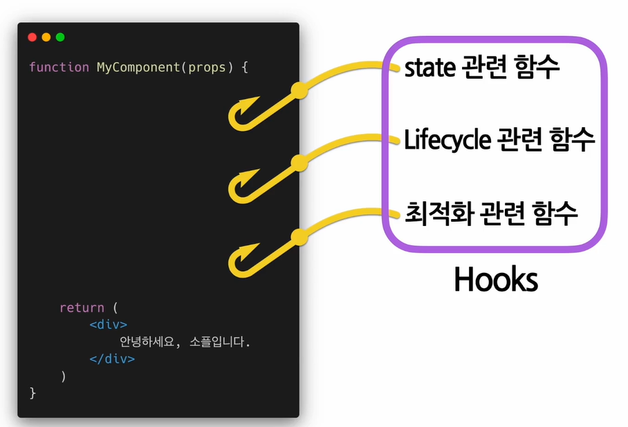
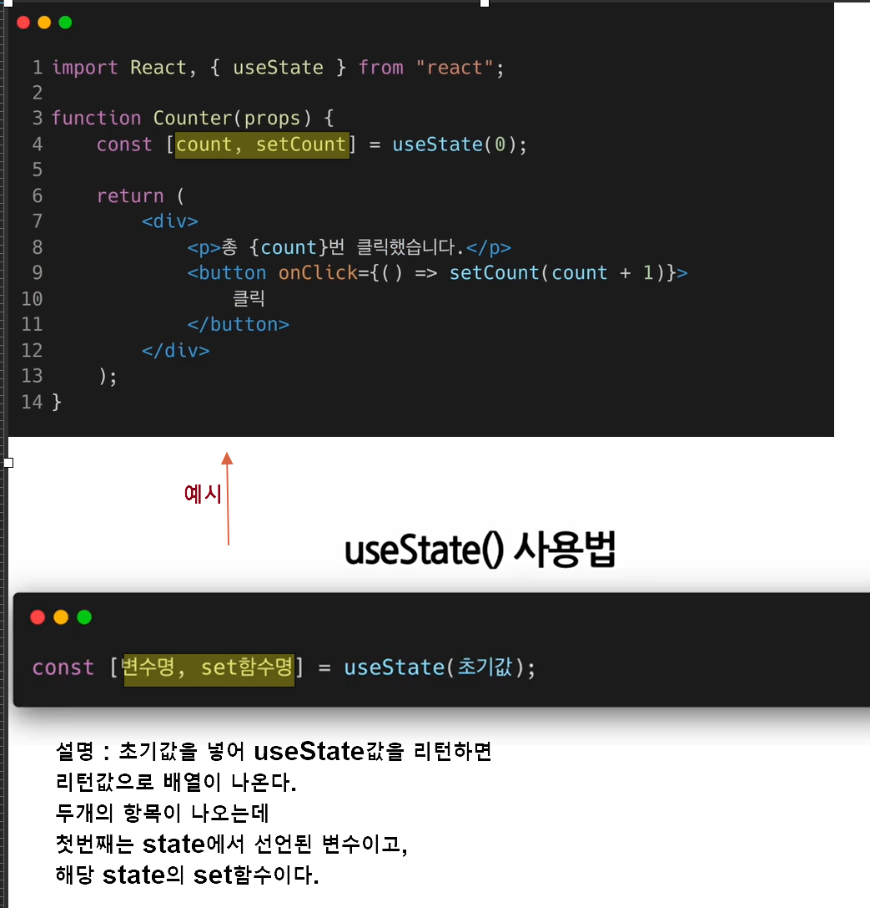
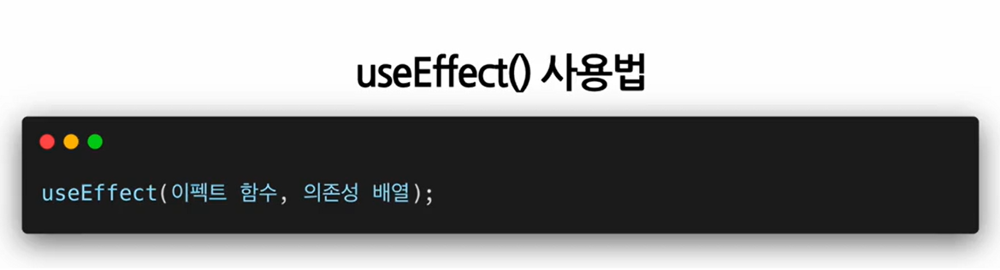

## 1. Hooks개념과 useState,useEffect

- Hooks이란
- component에는 state라는 중요한 개념이 있다.
  이 state를 필요해서 랜더링을 관리하게 된다. -
- 위그림에서보면 위의 사용불가를 지원하기 위해 나온것이 Hooks이다.
- Hooks를 사용하면 클래스컴포넌트처럼 동일하게 구현가능하다. 
  //
- 

- 원하는 시점에 정해진 함수를 실현하게 된다.
- 이런 Hooks의 이름을 Uses로 시작한다.

`Hooks 종류`

## 2. useState()

- state를 사용하기 위한Hook()
- 클래스컴포넌트 처럼 state를 사용하기 위해..
- 재랜더링하기 어렵기 때문에 useState()를 사용해야 한다.
- 
- --> 설명
- 카운트 값이 변경되면 컴포넌트가 재렌더링 되면서 화면에 새로운 카운트 값이 표시된다.
  이 과정은 클래스 컴포넌트에서 setState함수를 호출해서 state가 업데이트되고 이후 컴포넌트가 재런더링 되는 과정과 동일하다고 보면된다.
-

## 3. useEffect()

- Side effect를 수행하기 위한Hook
  `` Side effect란..`
- 예를 들면 서버에서 데이터를 받아오거나 수동으로 DOM을 변경하는 드으이 작업을 의미한다.
- 이유는 다른컴포넌트에 영향을 미칠 수 있으며
  렌더링 중에는 작업이 완료될 수 없기 때문
- 그래서 끝나야 랜덩링된다.
- 리액트의 함수 컴포넌트에서 사이드 이펙트를 실행할 수 있게 해주는 것이 Hook이다.

- 

- 의존성 배열 : 이 이펙트가 의존하고 있는 배열인데 배열 안에 있는 변수중에 하나라도 값이 변경되었을 때 이펙트 함수가 실행된다.
  기본적으로 이펙트 함수는 처음 컴포넌트가 랜더링 된 이후와 업데이트로 인한 재런더링 이후에 실행된다.
