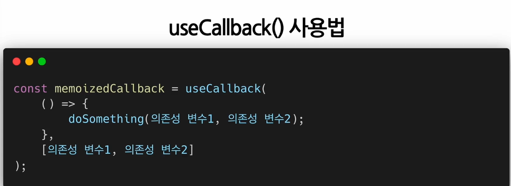

## 4.useMemo()

- Memoized value를 리턴하는 Hook 
  `Memoization 개념`
  - 연산량이 많이드는 함수의 호출결과를 저장해 두었다가 같은 입력 값으로 함수를 호출하면 새로 함수를 호출하지 않고 이전에 저장해 놨던 호출 결과를 바로 반환하는 것이다.
  - 메모이제이션이 된 결과값을 영어로는 Memoized Value라고 부른다.
  - 메모를 해두었다가 나중에 다시 사용하는 것
- useMemo 훅을 사용할떄 기억해야 할점은 useMemo로 전달된 함수는 렌더링이 일어나는 동안 실행된다는 점이다.
- 그래서 렌더링이 일어아는 동안 실행돼서는 안될 작업을 useMemo의 함수에 넣으면 안된다.
- 
- 
- 마운트 이후에는 값이 변경되지 않는다.
- 빈배열은 마운트 시점에만 한번 값을 계산할 필요가 있을 경우에는 이렇게 사용하면 된다.
- 하지만 대부분 useMemo 훅에 의존성 배열의 변수들을 넣고 해당 변수들의 값이 바뀜에 따라 새로 값을 계산해야 할 경우에 사용한다.

## 5. useCallback()

- useMemo()Hook과 유사하지만 값이 아닌 함수를 반환한다.
- 컴포넌트가 렌더링 될떄마다 매번 함수를 새로 정의하는 것이 아니라 의존성 배열의 값이 바뀐 경우에만 함수를 새로 정의해서 리턴해 준다.
- 
- 
- 
- 위 코드처럼 useCallbackHook을 사용하지 않고 컴포넌트 내에서 정의한 함수를 자식 컴포넌트의 props로 넘겨 사용하는 경우에 부모 컴포넌트가 다시 렌더링이 될 때마다 매번 자식 컴포넌트도 다시 렌더링 된다.
- 
- 위의 코드처럼 useCallbackHook을 사용하면 특정 변수의 값이 변한 경우에만 함수를 다시 정의하게 되므로 함수가 다시 정의되지 않는 경우에는 자식 컴포넌트도 재렌더링이 일어나지 않는다.
  이 경우에 의존성 배열에 빈 배열이 들어갔기 때문에 컴포넌트가 처음 마운트 되는 시점에만 함수가 정의되고 이후에는 다시 정의되지 않으며 결국 자식 컴포넌트도 불필요하게 재렌더링이 일어나지 않게 된다.

## 6. useRef()

- Reference를 사용하기 위한Hook  
  `래퍼런스 란?` - 특정 컴포넌트에 접근할 수 있는 객체
- 이 래퍼런스 객체를 반환한다.
- 
- 
  - 파라미터로 초기값을 넣으면 해당 초기값으로 초기화된 레퍼런스 객체를 반환한다.
  - 이렇게 반환된 레퍼런스 객체는 컴포넌트의 라이프타임 전체에 걸쳐서 유지된다.
  - 컴포넌트가 마움트 헤제 전까지는 계쏙 유지한다.
